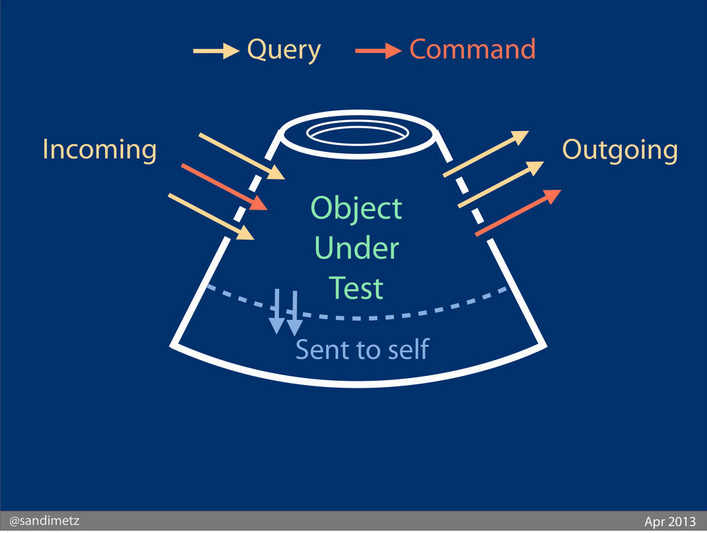
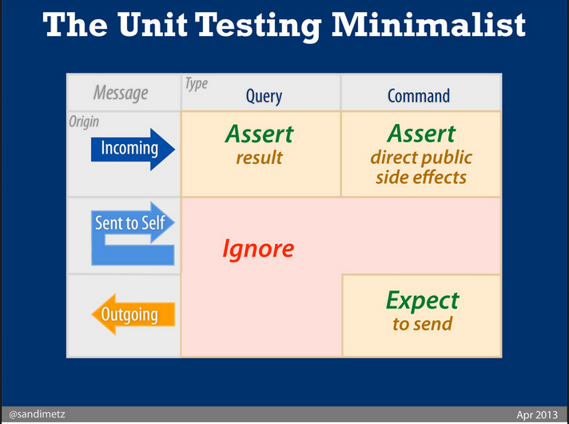

# Theory

## Test-First

* Test first, comes from XP by Kent Beck.
* The XP values are **Comunication**, **Simplicity**, **Feeback**, **Courage** and **Respect**.
* Test-First, is **writing a failing automated test before changing any code**.

And addresses many problems at once...

### Scope creep

No more **just in case** code, if you need to put that other code in, write another test after you've made this one work.

### Coupling and cohesion

 If it's hard to write a test, it's a signal that you have a design problem. **Loosely coupled, highly cohesive code is easy to test**.

### Trust

It's hard to trust the author of code that doesn't work. **Writing clean code that works and demonstrating your intentions** with automated tests, give your teammates a reason to trust you.

### Rhythm

It's easy to get lost for hours when you are coding. When programming test-first, it's clear what to do next: **either write another test or make the broken test work**. Soon this develops into a netural and efficient rhythm...

test, code, refactor, test, code, refactor...

## Magic Tricks of Testing by Sandi Metz

